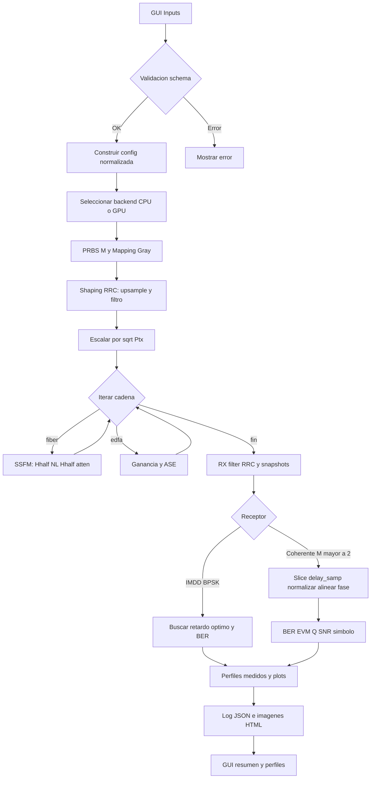

# Manual del Simulador FiberSim (orientado a la GUI)

Este documento describe el flujo completo del simulador desde la GUI, los componentes internos clave y el porqué de las decisiones de diseño. Al final incluye un diagrama de flujo del pipeline de simulación.

---

## 1. Panorama general

- Frontend: GUI en Streamlit (`src/fibersim/gui/app.py`).
- Orquestación: CLI/servicio en `src/fibersim/main.py` (función `_execute`).
- Núcleo numérico: `src/fibersim/core` (PRBS, shaping RRC, fibra SSFM, EDFA, plots).
- Esquema de configuración: `src/fibersim/schema.py` con Pydantic v2.
- Salidas: imágenes y HTML en `plots/`, log JSON con config normalizada y métricas en `logs/`.

Motivación: separar GUI, orquestación y núcleo permite probar por CLI, alternar CPU/GPU y reutilizar funciones.

---

## 2. GUI: cómo se usa y qué hace

La página principal ofrece:

- Parámetros globales: Rb [Gbaud], Ptx [dBm], calidad (ajusta Nsym), y avanzado (sps, Nsym, modulación y receptor). Si M>2 (QPSK/16QAM) se fuerza receptor coherente.
- Pulso: RRC con sliders de roll y span.
- Builder de cadena: bloques FIBER y EDFA. Cada tarjeta permite mover, duplicar, borrar y editar parámetros.
- Ejecución: flags de GPU, override de dz, pérdidas de inserción/fusión, snapshots de constelación, 3D, eye, y carpetas de salida.
- Resultados: chips de resumen (backend, BER en porcentaje, SNR símbolo, OSNR), imágenes, 3D HTML, y perfiles z (medidos si están en el log; si no, estimados localmente).
- Carga de ejemplos: presets embebidos y detección automática de `examples/configs/*.json` válidos.

Por qué así: controles simples por defecto, y avanzados opcionales. El builder evita errores de JSON a mano.

---

## 3. Estructura de configuración (schema)

`SimConfig` tiene cuatro secciones:

- `global`: Rb, M, sps, Fs, Nsym, Ptx, mod (BPSK/QPSK/16QAM), rx (imdd/coh), pol (sp/dp).
- `pulse`: tipo (RRC), roll y span.
- `chain`: lista de bloques `fiber` o `edfa`.
- `dsp` (opcional): parámetros para receptor coherente básico.

Bloque `fiber.par`:

- L [m], beta2 [s^2/m], gamma [1/(W·m)], dz [m], alpha [1/m].

Bloque `edfa.par`:

- G_dB, nsp (factor de población, equivalente a NF simple).

Decisiones: tipos y límites validan inputs en GUI y CLI, y ahorrar validaciones manuales.

---

## 4. Pipeline de simulación (desde `_execute`)

1) Backend: CPU NumPy o GPU CuPy. Se recarga dinámicamente `core/array_api` y módulos para aplicar el backend elegido.
2) PRBS y mapeo a símbolos: PRBS genera bits para M; `core/modem.map_bits_to_symbols` aplica Gray mapping y normaliza potencia media (BPSK/QPSK/16QAM).
3) Shaping TX: `core/pulse.pulse_shaper` hace upsample y filtra con RRC; guarda `pulseDelay` y `sps`.
4) Potencia de entrada: escala por `sqrt(Ptx)`.
5) Cadena: `core/chain.run_chain` recorre bloques. Para fibra usa `core/fiber.fiber_ssfm` (split-step con kernel lineal y no lineal, atenuación). Para EDFA usa `core/edfa.edfa_block` (ganancia, ASE banda Rs). Guarda snapshots de constelación con el mismo filtro RX (RRC) y slicing determinista con `delay_samp = 2*pulseDelay`.
6) RX y métricas:
   - IMDD BPSK: búsqueda de mejor retardo discreto en una ventana alrededor de `delay_samp` y cálculo de BER.
   - Coherente (QPSK/16QAM): slicing en `delay_samp`, normalización y alineación de fase global vs referencia, EVM, Q, BER y SNR a nivel de símbolo.
7) Perfiles medidos: si hay snapshots, se arma `result.profile` con z[km], P[dBm] y OSNR si está disponible.
8) Plots: constelaciones (grid y 3D HTML) y potencia vs z. Eye final opcional.
9) Log: config normalizada y `result` en `logs/simlog_*.json`.

Por qué así: slicing determinista evita dobles contajes de delay. La ruta coherente simplificada (normalizar + fase global) es robusta para QPSK/16QAM sin DSP pesado.

---

## 5. Núcleo: decisiones de diseño clave

- Array API: unifica NumPy y CuPy, y SciPy/cupyx.scipy para filtros; permite cambiar entre CPU/GPU sin bifurcar código.
- SSFM: pasos con medio paso lineal (FFT, kernel Hhalf) y paso no lineal; atenuación por medio paso. `dz` override desde la GUI acelera pruebas.
- EDFA: modelo simple con ASE sobre Rs; acumulación de OSNR en perfiles estimados y en resultados medidos si se instrumenta en la cadena.
- Modem: Gray mapping correcto (QPSK con XOR en rama Q), constelaciones de potencia unitaria, normalización y alineación de fase, BER/EVM/Q confiables.
- Snapshots: se filtra con el mismo RRC RX y se samplea con `delay_samp` consistente. Para visualización, se normalizan individualmente sin afectar métricas.

---

## 6. Diagrama de flujo (Mermaid)



---

## 7. Cómo exportar este manual a PDF

- Opción 1 (VS Code): abre este `.md` y usa la extensión "Markdown PDF" o similar para exportar a PDF.
- Opción 2 (CLI pandoc):
  - Instala pandoc y una distribución LaTeX.
  - Comando ejemplo: `pandoc -s docs/simulador_gui_manual.md -o docs/simulador_gui_manual.pdf`
- Opción 3 (Imprimir a PDF): abre el archivo en el navegador y usa "Imprimir" → "Guardar como PDF".

---

## 8. Apéndice: rutas relevantes

- GUI: `src/fibersim/gui/app.py`
- Orquestación: `src/fibersim/main.py`
- Esquema: `src/fibersim/schema.py`
- Núcleo: `src/fibersim/core/*` (prbs.py, pulse.py, chain.py, fiber.py, edfa.py, modem.py, plot.py)
- Logs y plots: `logs/`, `plots/`
- Ejemplos: `examples/configs/*.json` (la GUI los detecta automáticamente si validan contra el esquema)

---

## Requisitos

- Python 3.10 o superior
- Windows, Linux o macOS

Dependencias principales:
- numpy, scipy, matplotlib, plotly, streamlit
- typer, rich
- pydantic 2.x

Opcional para GPU:
- instalar CUDA 12.9 desde: https://developer.nvidia.com/cuda-12-9-0-download-archive
- cupy-cudaXX compatible con tu versión de CUDA

Archivo sugerido `requirements.txt`:

```txt
numpy>=1.23
scipy>=1.9
matplotlib>=3.7
plotly>=5.17
streamlit>=1.30
typer[all]>=0.9
rich>=13.0
pydantic>=2.4
# GPU opcional, instala solo si tienes CUDA
# cupy-cuda12x>=12.0
# o
# cupy-cuda11x>=12.0
```

---

## Instalación

Clona el repo y crea un entorno:

```bash
git clone https://github.com/pdc9019/FiberSim.git
cd FiberSim

# venv de ejemplo
python -m venv .venv
# Windows
.venv\Scripts\activate
# Linux/macOS
# source .venv/bin/activate

pip install --upgrade pip
pip install -r requirements.txt
```

GPU opcional con CuPy: instala el wheel que corresponda a tu CUDA.

```bash
# Ejemplos, elige uno
pip install cupy-cuda12x
# o
pip install cupy-cuda11x
```

---

## Ejecución de la GUI

```bash
# PowerShell (Windows): exporta PYTHONPATH para que 'src' se resuelva
$env:PYTHONPATH = "src"
streamlit run src/fibersim/gui/app.py
```
