# Simulador FiberSim 

Este documento describe el flujo completo del simulador desde la GUI, los componentes internos clave y el porqué de las decisiones de diseño. Al final incluye un diagrama de flujo del pipeline de simulación.

---

## 1. Panorama general

- Frontend: GUI en Streamlit (`src/fibersim/gui/app.py`).
- Orquestación: CLI/servicio en `src/fibersim/main.py` (función `_execute`).
- Núcleo numérico: `src/fibersim/core` (PRBS, shaping RRC, fibra SSFM, EDFA, plots).
- Esquema de configuración: `src/fibersim/schema.py` con Pydantic v2.
- Modulaciones soportadas: BPSK, QPSK, 16QAM con pulsos Root-Raised Cosine (RRC).
- Salidas: imágenes y HTML en `plots/`, log JSON con config normalizada y métricas en `logs/`.

Motivación: separar GUI, orquestación y núcleo permite probar por CLI, alternar CPU/GPU y reutilizar funciones.

---

## 2. GUI: cómo se usa y qué hace

La página principal ofrece:

- Parámetros globales: Rb [Gbaud], Ptx [dBm], calidad (ajusta Nsym), y avanzado (sps, Nsym, modulación y receptor). Modulaciones disponibles: BPSK, QPSK, 16QAM. Si M>2 (QPSK/16QAM) se fuerza receptor coherente.
- Pulso: Root-Raised Cosine (RRC) con sliders de roll-off (β) y span. No se utilizan pulsos NRZ.
- Builder de cadena: bloques FIBER y EDFA. Cada tarjeta permite mover, duplicar, borrar y editar parámetros.
- Ejecución: flags de GPU, override de dz, pérdidas de inserción/fusión, snapshots de constelación, gráfico 3D interactivo, eye, y carpetas de salida.
- Resultados: chips de resumen (backend, BER en porcentaje, SNR símbolo, OSNR), imágenes, gráfico 3D HTML de constelaciones a lo largo del enlace, y perfiles z (medidos si están en el log; si no, estimados localmente).
- Carga de ejemplos: presets embebidos y detección automática de `examples/configs/*.json` válidos.

Por qué así: controles simples por defecto, y avanzados opcionales. El builder evita errores de JSON a mano.

---

## 3. Estructura de configuración (schema)

`SimConfig` tiene cuatro secciones:

- `global`: Rb, M, sps, Fs, Nsym, Ptx, mod (BPSK/QPSK/16QAM), rx (imdd/coh), pol (sp/dp).
- `pulse`: tipo Root-Raised Cosine (RRC únicamente), parámetros roll-off (β) y span.
- `chain`: lista de bloques `fiber` o `edfa`.
- `dsp` (opcional): parámetros para receptor coherente básico.

Bloque `fiber.par`:

- L [m], beta2 [s^2/m], gamma [1/(W·m)], dz [m], alpha [1/m].

Bloque `edfa.par`:

- G_dB, nsp (factor de población, equivalente a NF simple).

Decisiones: tipos y límites validan inputs en GUI y CLI, y ahorrar validaciones manuales.

---

## 4. Pipeline de simulación (desde `_execute`)

1) Backend: CPU NumPy o GPU CuPy. Se recarga dinámicamente `core/array_api` y módulos para aplicar el backend elegido.
2) PRBS y mapeo a símbolos: PRBS genera bits para M; `core/modem.map_bits_to_symbols` aplica Gray mapping y normaliza potencia media. Modulaciones soportadas: BPSK, QPSK, 16QAM.
3) Shaping TX: `core/pulse.pulse_shaper` hace upsample y filtra con pulsos Root-Raised Cosine (RRC); guarda `pulseDelay` y `sps`. No se utilizan pulsos NRZ.
4) Potencia de entrada: escala por `sqrt(Ptx)`.
5) Cadena: `core/chain.run_chain` recorre bloques. Para fibra usa `core/fiber.fiber_ssfm` (split-step con kernel lineal y no lineal, atenuación). Para EDFA usa `core/edfa.edfa_block` (ganancia, ASE banda Rs). Guarda snapshots de constelación con el mismo filtro RX (RRC) y slicing determinista con `delay_samp = 2*pulseDelay`.
6) RX y métricas:
   - IMDD BPSK: búsqueda de mejor retardo discreto en una ventana alrededor de `delay_samp` y cálculo de BER.
   - Coherente (QPSK/16QAM): slicing en `delay_samp`, normalización y alineación de fase global vs referencia, EVM, Q, BER y SNR a nivel de símbolo.
7) Perfiles medidos: si hay snapshots, se arma `result.profile` con z[km], P[dBm] y OSNR si está disponible.
8) Plots: constelaciones en grid 2D, gráfico 3D interactivo HTML que muestra la evolución de las constelaciones a lo largo del enlace, y potencia vs z. Eye final opcional.
9) Log: config normalizada y `result` en `logs/simlog_*.json`.

Por qué así: slicing determinista evita dobles contajes de delay. La ruta coherente simplificada (normalizar + fase global) es robusta para QPSK/16QAM sin DSP pesado.

---

## 5. Núcleo: decisiones de diseño clave

- Array API: unifica NumPy y CuPy, y SciPy/cupyx.scipy para filtros; permite cambiar entre CPU/GPU sin bifurcar código.
- SSFM: pasos con medio paso lineal (FFT, kernel Hhalf) y paso no lineal; atenuación por medio paso. `dz` override desde la GUI acelera pruebas.
- EDFA: modelo simple con ASE sobre Rs; acumulación de OSNR en perfiles estimados y en resultados medidos si se instrumenta en la cadena.
- Modem: Gray mapping correcto (QPSK con XOR en rama Q), constelaciones de potencia unitaria, normalización y alineación de fase, BER/EVM/Q confiables. Soporta BPSK, QPSK y 16QAM.
- Pulsos: únicamente Root-Raised Cosine (RRC) con parámetros configurables de roll-off y span. No se utilizan pulsos NRZ.
- Snapshots: se filtra con el mismo RRC RX y se samplea con `delay_samp` consistente. Para visualización en gráfico 3D, se normalizan individualmente sin afectar métricas.

---

## 6. Diagrama de flujo

```mermaid
flowchart TD
    Start([Inicio]) --> LoadConfig["Cargar configuración JSON"]
    LoadConfig --> ValidateSchema{"Validación<br/>Pydantic"}
  
    ValidateSchema -->|"Error"| ShowError["Mostrar error<br/>y detener"]
    ValidateSchema -->|"OK"| SelectBackend["Seleccionar backend<br/>CPU NumPy o GPU CuPy"]
  
    SelectBackend --> ReloadModules["Recargar módulos<br/>con backend seleccionado"]
    ReloadModules --> ExtractParams["Extraer parámetros:<br/>parGlob, chain, pulse_par, dsp_par"]
  
    %% TRANSMISOR
    ExtractParams --> TxStart["<b>TRANSMISOR</b>"]
    TxStart --> PRBS["Generar bits PRBS<br/>según modulación M"]
    PRBS --> MapGray["Mapeo Gray bits→símbolos<br/>BPSK/QPSK/16-QAM"]
    MapGray --> Upsample["Upsample x sps<br/>insertar ceros"]
    Upsample --> RRCFilter["Filtro conformador RRC<br/>lfilter con h TX"]
    RRCFilter --> NormalizePower["Normalizar potencia<br/>P_media = 1"]
    NormalizePower --> ScalePower["Escalar por √Ptx<br/>Ein = √Ptx × señal"]
  
    ScalePower --> CheckAWGN_TX{"AWGN TX<br/>habilitado?"}
    CheckAWGN_TX -->|"Sí"| AddAWGN_TX["Añadir ruido AWGN TX<br/>SNR = base + 5 dB"]
    CheckAWGN_TX -->|"No"| ChainStart
    AddAWGN_TX --> ChainStart
  
    %% CADENA DE PROPAGACIÓN
    ChainStart["<b>CADENA DE PROPAGACIÓN</b>"] --> InitChain["Inicializar:<br/>A = Ein, zCum = 0"]
    InitChain --> InsertionLoss{"Pérdida de<br/>inserción?"}
    InsertionLoss -->|"Sí"| ApplyInsertion["Atenuar A por<br/>insertion_dB"]
    InsertionLoss -->|"No"| IterateChain
    ApplyInsertion --> IterateChain
  
    IterateChain{"Más bloques<br/>en chain?"} -->|"Sí, tipo=fiber"| FiberBlock
    IterateChain -->|"Sí, tipo=edfa"| EDFABlock
    IterateChain -->|"No"| ChainEnd
  
    %% BLOQUE FIBRA
    FiberBlock["<b>Bloque FIBER</b>"] --> CalcSteps["Calcular nSteps = ⌈L/dz⌉"]
    CalcSteps --> PrecomputeKernels["Pre-computar kernels:<br/>Hhalf dispersión, att_step"]
    PrecomputeKernels --> SSFMLoop{"Para cada paso<br/>SSFM"}
  
    SSFMLoop --> HalfLinear1["Medio paso lineal:<br/>FFT → ×Hhalf → IFFT"]
    HalfLinear1 --> Nonlinear["Paso no lineal Kerr:<br/>A × exp(i×γ×|A|²×dz)"]
    Nonlinear --> HalfLinear2["Medio paso lineal:<br/>FFT → ×Hhalf → IFFT"]
    HalfLinear2 --> Attenuation["Atenuación:<br/>A × att_step"]
  
    Attenuation --> SSFMLoop
    SSFMLoop -->|"Todos completados"| AttenuateASE["Atenuar P_ASE_total<br/>por e^-αL"]
  
    AttenuateASE --> CaptureConst1{"do_const y<br/>paso alcanzado?"}
    CaptureConst1 -->|"Sí"| ApplyRxFilter1["Aplicar filtro RRC RX<br/>y submuestrear"]
    CaptureConst1 -->|"No"| CheckSplice
    ApplyRxFilter1 --> SaveSnapshot1["Guardar símbolos<br/>en consSym, consZ"]
    SaveSnapshot1 --> CheckSplice
  
    CheckSplice{"Pérdida de<br/>splice?"} -->|"Sí y siguiente=fiber"| ApplySplice["Atenuar A por<br/>splice_dB"]
    CheckSplice -->|"No"| IterateChain
    ApplySplice --> IterateChain
  
    %% BLOQUE EDFA
    EDFABlock["<b>Bloque EDFA</b>"] --> CalcGain["Calcular ganancia lineal<br/>G = 10^(G_dB/10)"]
    CalcGain --> Amplify["Amplificar señal:<br/>A × √G"]
    Amplify --> CalcASE["Calcular potencia ASE:<br/>Pase = nsp×h×ν×(G-1)×Rs/2"]
    CalcASE --> GenNoise["Generar ruido gaussiano<br/>complejo"]
    GenNoise --> AddASE["Sumar ASE a señal:<br/>A + noise"]
    AddASE --> AccumASE["Acumular P_ASE_total:<br/>P_prev×G + Pase"]
  
    AccumASE --> CaptureConst2{"do_const?"}
    CaptureConst2 -->|"Sí"| ApplyRxFilter2["Aplicar filtro RRC RX<br/>y submuestrear"]
    CaptureConst2 -->|"No"| CalcOSNR
    ApplyRxFilter2 --> SaveSnapshot2["Guardar símbolos"]
    SaveSnapshot2 --> CalcOSNR["Calcular OSNR:<br/>10×log10(Psig/Pase)"]
    CalcOSNR --> IterateChain
  
    %% FIN DE CADENA
    ChainEnd["<b>FIN DE CADENA</b>"] --> CheckAWGN_RX{"AWGN RX<br/>habilitado?"}
    CheckAWGN_RX -->|"Sí"| AddAWGN_RX["Añadir ruido AWGN RX<br/>SNR = base dB"]
    CheckAWGN_RX -->|"No"| UpdateConstFinal
    AddAWGN_RX --> UpdateConstFinal["Actualizar última<br/>constelación post-AWGN"]
    UpdateConstFinal --> RxStart
  
    %% RECEPTOR
    RxStart["<b>RECEPTOR</b>"] --> CheckRxMode{"Modo RX"}
    CheckRxMode -->|"IMDD BPSK"| FindDelay["Buscar retardo óptimo<br/>±halfwin muestras"]
    CheckRxMode -->|"Coherente M>2"| SliceSymbols["Submuestrear a símbolos<br/>en delay_samp"]
  
    FindDelay --> SliceBPSK["Submuestrear señal<br/>en delay óptimo"]
    SliceBPSK --> CalcBER_BPSK["Calcular BER BPSK<br/>comparando bits"]
  
    SliceSymbols --> CheckPhase{"M > 2?"}
    CheckPhase -->|"Sí QPSK/16QAM"| AlignPhase["Alineación de fase<br/>carrier_phase_align"]
    CheckPhase -->|"No BPSK"| CalcMetrics
    AlignPhase --> CalcMetrics["Calcular métricas:<br/>BER, EVM, Q-factor"]
  
    CalcBER_BPSK --> CalcOSNRFinal
    CalcMetrics --> CalcOSNRFinal["Obtener OSNR final<br/>del último bloque"]
  
    CalcOSNRFinal --> CalcSNReff{"AWGN RX<br/>presente?"}
    CalcSNReff -->|"Sí"| CombineSNR["Combinar SNR efectivo:<br/>1/SNR_eff = 1/OSNR + 1/SNR_AWGN"]
    CalcSNReff -->|"No"| BuildResult
    CombineSNR --> BuildResult
  
    %% RESULTADOS Y LOGGING
    BuildResult["<b>RESULTADOS</b><br/>Construir diccionario result"] --> WriteLog["Escribir log JSON<br/>con config + métricas"]
    WriteLog --> CheckPlots{"Generar<br/>gráficos?"}
  
    CheckPlots -->|"do_const"| NormalizeConst["Normalizar constelaciones<br/>para visualización"]
    CheckPlots -->|"No"| End
  
    NormalizeConst --> FilterPlot2D["Diezmar según<br/>step_plot2d_km"]
    FilterPlot2D --> Plot2D["Guardar grid 2D<br/>constelaciones.png"]
    Plot2D --> PlotPower["Guardar evolución<br/>potencia.png"]
    PlotPower --> Check3D{"do_const3d?"}
  
    Check3D -->|"Sí"| Plot3D_PNG["Guardar 3D matplotlib<br/>constelaciones_3d.png"]
    Check3D -->|"No"| Check3D_HTML
    Plot3D_PNG --> Check3D_HTML
  
    Check3D_HTML{"do_const3d_html?"} -->|"Sí"| AdaptiveStep["Calcular paso adaptativo<br/>~400 pts totales"]
    Check3D_HTML -->|"No"| CheckEye
    AdaptiveStep --> Plot3D_HTML["Guardar 3D interactivo<br/>constelaciones_3d.html"]
    Plot3D_HTML --> CheckEye
  
    CheckEye{"do_eye?"} -->|"Sí"| PlotEye["Guardar eye diagram<br/>eye.png"]
    CheckEye -->|"No"| PrintResults
    PlotEye --> PrintResults
  
    PrintResults["Imprimir resumen:<br/>L, G, BER, OSNR, tiempo"] --> End([Fin])
  
    ShowError --> End
  
    %% ESTILOS
    classDef txClass fill:#1565c0,stroke:#0d47a1,stroke-width:2px,color:#fff
    classDef chainClass fill:#e65100,stroke:#bf360c,stroke-width:2px,color:#fff
    classDef rxClass fill:#2e7d32,stroke:#1b5e20,stroke-width:2px,color:#fff
    classDef outputClass fill:#6a1b9a,stroke:#4a148c,stroke-width:2px,color:#fff
    classDef decisionClass fill:#f57f17,stroke:#f9a825,stroke-width:2px,color:#000
  
    class TxStart,PRBS,MapGray,Upsample,RRCFilter,NormalizePower,ScalePower,AddAWGN_TX txClass
    class ChainStart,InitChain,FiberBlock,EDFABlock,CalcSteps,PrecomputeKernels,SSFMLoop,HalfLinear1,Nonlinear,HalfLinear2,Attenuation,AttenuateASE,CalcGain,Amplify,CalcASE,GenNoise,AddASE,AccumASE chainClass
    class RxStart,FindDelay,SliceBPSK,SliceSymbols,AlignPhase,CalcBER_BPSK,CalcMetrics,CalcOSNRFinal,CombineSNR rxClass
    class BuildResult,WriteLog,NormalizeConst,FilterPlot2D,Plot2D,PlotPower,Plot3D_PNG,Plot3D_HTML,PlotEye,PrintResults outputClass
    class ValidateSchema,CheckAWGN_TX,InsertionLoss,IterateChain,CaptureConst1,CheckSplice,CaptureConst2,CheckAWGN_RX,CheckRxMode,CheckPhase,CalcSNReff,CheckPlots,Check3D,Check3D_HTML,CheckEye decisionClass
```



---

## 8. Apéndice: rutas relevantes

- GUI: `src/fibersim/gui/app.py`
- Orquestación: `src/fibersim/main.py`
- Esquema: `src/fibersim/schema.py`
- Núcleo: `src/fibersim/core/*` (prbs.py, pulse.py, chain.py, fiber.py, edfa.py, modem.py, plot.py)
- Logs y plots: `logs/`, `plots/`
- Ejemplos: `examples/configs/*.json` (la GUI los detecta automáticamente si validan contra el esquema)

---

## Requisitos del Sistema

- **Python 3.10 o superior**
- **Git** (para clonar el repositorio)
- **Sistema Operativo**: Windows, Linux o macOS

### Dependencias principales:

- numpy, scipy, matplotlib, plotly, streamlit
- typer, rich, pydantic 2.x

### Opcional para GPU (aceleración CuPy):

- CUDA Toolkit 12.9 (versión específica requerida)
- Driver NVIDIA compatible
- Tarjeta gráfica NVIDIA con soporte CUDA

---

## Instalación Paso a Paso

### Paso 1: Instalar Git (si no lo tienes)

**Windows:**

- Descarga desde: https://git-scm.com/download/win
- Ejecuta el instalador y sigue las opciones por defecto
- Verifica en una terminal PowerShell:
  ```powershell
  git --version
  ```

**Linux (Debian/Ubuntu):**

```bash
sudo apt update
sudo apt install git
```

**macOS:**

```bash
# Usando Homebrew
brew install git
```

---

### Paso 2: Clonar el Repositorio

Abre una terminal (PowerShell en Windows, Terminal en Linux/macOS) y ejecuta:

```bash
git clone https://github.com/Pdc9019/Fibersim_py.git
cd Fibersim_py
```

---

### Paso 3: Crear un Entorno Virtual

**Windows (PowerShell):**

```powershell
py -m venv .venv
.venv\Scripts\Activate.ps1
```

**Linux/macOS:**

```bash
python3 -m venv .venv
source .venv/bin/activate
```

> **Nota**: El entorno virtual aísla las dependencias del proyecto. Verás `(.venv)` al inicio de tu terminal cuando esté activo.

---

### Paso 4: Instalar Dependencias

**IMPORTANTE**: Este simulador requiere GPU NVIDIA con CUDA. Instala EXACTAMENTE en este orden:

**4.1. Instalar CUDA Toolkit 12.9**

- Descarga CUDA 12.9 desde: https://developer.nvidia.com/cuda-12-9-0-download-archive
- Selecciona tu sistema operativo y sigue el instalador
- **CRÍTICO**: Debe ser versión 12.9, otras versiones pueden no ser compatibles
- Reinicia el sistema después de instalar

**4.2. Instalar dependencias Python**:

**Windows (PowerShell):**

```powershell
py -m pip install --upgrade pip
py -m pip install -r requirements.txt
py -m pip install cupy-cuda12x
```

**Linux/macOS:**

```bash
pip install --upgrade pip
pip install -r requirements.txt
pip install cupy-cuda12x
```

**4.3. Verificar instalación**:

**Windows (PowerShell):**

```powershell
py -c "import cupy as cp; print('CuPy version:', cp.__version__); print('CUDA available:', cp.cuda.is_available())"
```

**Linux/macOS:**

```bash
python3 -c "import cupy as cp; print('CuPy version:', cp.__version__); print('CUDA available:', cp.cuda.is_available())"
```

Si ves `CUDA available: True`, la instalación fue exitosa.

---

## Ejecución de la GUI

**Windows (PowerShell):**

```powershell
$env:PYTHONPATH = "src"
streamlit run src/fibersim/gui/app.py
```

**Linux/macOS:**

```bash
export PYTHONPATH="src"
streamlit run src/fibersim/gui/app.py
```

La GUI se abrirá automáticamente en tu navegador en `http://localhost:8501`

---

## Solución de Problemas Comunes

**Error: "git no se reconoce como comando"**

- Reinicia la terminal después de instalar Git
- En Windows, verifica que Git esté en el PATH del sistema

**Error: "python no se reconoce como comando"**

- En Windows usa `py` en lugar de `python`
- En Linux/macOS usa `python3`

**Error al activar entorno virtual (Windows PowerShell)**

- Ejecuta: `Set-ExecutionPolicy -ExecutionPolicy RemoteSigned -Scope CurrentUser`
- Luego vuelve a intentar activar el entorno

**CuPy no detecta la GPU**

- Verifica que tengas CUDA Toolkit 12.9 instalado (no otra versión)
- Asegúrate de tener el driver NVIDIA actualizado (versión 525.60.13 o superior)
- Reinicia el sistema después de instalar CUDA
